# Microservices Architecture with Kafka Streams

## 🏗️ Overall Infrastructure Diagram

```mermaid
graph TB
    %% External Clients
    Client[🌐 External Clients<br/>Web/Mobile Apps]
    
    %% API Gateway
    Gateway[🚪 API Gateway<br/>Port: 8080<br/>Spring Cloud Gateway]
    
    %% Core Infrastructure Services
    Discovery[🔍 Discovery Service<br/>Port: 8761<br/>Eureka Server]
    Config[⚙️ Config Service<br/>Port: 8888<br/>Spring Cloud Config]
    
    %% Business Services
    UserService[👤 User Service<br/>Port: 8081<br/>User Management]
    OrderService[📦 Order Service<br/>Port: 8082<br/>Order Management + CQRS]
    NotificationService[🔔 Notification Service<br/>Port: 8083<br/>Event-driven Notifications]
    AnalyticsService[📊 Analytics Service<br/>Port: 8084<br/>Real-time Analytics + Kafka Streams]
    
    %% Kafka Infrastructure
    Kafka[📨 Apache Kafka<br/>Port: 9092<br/>Event Streaming Platform]
    KafkaUI[🖥️ Kafka UI<br/>Port: 8080<br/>Kafka Management]
    
    %% Databases
    UserDB[(🗄️ User DB<br/>H2 In-Memory)]
    OrderDB[(🗄️ Order DB<br/>H2 In-Memory)]
    OrderReadDB[(🗄️ Order Read DB<br/>H2 In-Memory)]
    NotificationDB[(🗄️ Notification DB<br/>H2 In-Memory)]
    AnalyticsDB[(🗄️ Analytics DB<br/>H2 In-Memory)]
    
    %% Kafka Topics
    UserEvents[📢 user-events<br/>User CRUD Events]
    OrderEvents[📢 order-events<br/>Order CRUD Events]
    AnalyticsEvents[📢 analytics-events<br/>General Analytics]
    RevenueAnalytics[📢 revenue-analytics<br/>Revenue Metrics]
    UserActivityAnalytics[📢 user-activity-analytics<br/>User Activity]
    AnalyticsAlerts[📢 analytics-alerts<br/>Real-time Alerts]
    
    %% Connections
    Client --> Gateway
    Gateway --> Discovery
    Gateway --> UserService
    Gateway --> OrderService
    Gateway --> AnalyticsService
    
    %% Service Discovery
    UserService --> Discovery
    OrderService --> Discovery
    NotificationService --> Discovery
    AnalyticsService --> Discovery
    Config --> Discovery
    
    %% Configuration
    UserService --> Config
    OrderService --> Config
    NotificationService --> Config
    AnalyticsService --> Config
    
    %% Databases
    UserService --> UserDB
    OrderService --> OrderDB
    OrderService --> OrderReadDB
    NotificationService --> NotificationDB
    AnalyticsService --> AnalyticsDB
    
    %% Kafka Event Flows
    UserService --> UserEvents
    OrderService --> OrderEvents
    
    %% Analytics Stream Processing
    UserEvents --> AnalyticsService
    OrderEvents --> AnalyticsService
    AnalyticsService --> AnalyticsEvents
    AnalyticsService --> RevenueAnalytics
    AnalyticsService --> UserActivityAnalytics
    AnalyticsService --> AnalyticsAlerts
    
    %% Notification Flow
    UserEvents --> NotificationService
    
    %% Kafka Management
    Kafka --> KafkaUI
    
    %% Styling
    classDef service fill:#e1f5fe,stroke:#01579b,stroke-width:2px
    classDef infrastructure fill:#f3e5f5,stroke:#4a148c,stroke-width:2px
    classDef database fill:#e8f5e8,stroke:#1b5e20,stroke-width:2px
    classDef kafka fill:#fff3e0,stroke:#e65100,stroke-width:2px
    classDef topic fill:#ffebee,stroke:#c62828,stroke-width:2px
    
    class Gateway,UserService,OrderService,NotificationService,AnalyticsService service
    class Discovery,Config,Kafka,KafkaUI infrastructure
    class UserDB,OrderDB,OrderReadDB,NotificationDB,AnalyticsDB database
    class UserEvents,OrderEvents,AnalyticsEvents,RevenueAnalytics,UserActivityAnalytics,AnalyticsAlerts topic
```

## 🔄 Event Flow Diagrams

### 1. User Registration Flow

### 2. Order Creation Flow with CQRS

### 3. Real-time Analytics Flow

## 📊 Data Flow Architecture

### Event-Driven Communication

### CQRS Pattern in Order Service

## 🚀 Technology Stack

### Core Technologies
- **Java 21** - Programming Language
- **Spring Boot 3.5.3** - Application Framework
- **Spring Cloud 2025.0.0** - Microservices Framework
- **Spring WebFlux** - Reactive Web Framework
- **Project Reactor** - Reactive Programming

### Microservices Infrastructure
- **Eureka Server** - Service Discovery
- **Spring Cloud Config** - Configuration Management
- **Spring Cloud Gateway** - API Gateway
- **R2DBC** - Reactive Database Connectivity
- **H2 Database** - In-Memory Database

### Event Streaming & Analytics
- **Apache Kafka 3.6.0** - Event Streaming Platform
- **Kafka Streams** - Stream Processing
- **Spring Kafka** - Kafka Integration

### Development & Monitoring
- **Spring Boot Actuator** - Health Monitoring
- **Kafka UI** - Kafka Management Interface
- **Maven** - Build Tool

## 🔧 Key Features

### 1. Reactive Architecture
- Non-blocking I/O operations
- Backpressure handling
- Efficient resource utilization
- High concurrency support

### 2. Event-Driven Communication
- Loose coupling between services
- Asynchronous processing
- Event sourcing capabilities
- Real-time data flow

### 3. CQRS Pattern
- Command/Query separation
- Optimized read models
- Eventual consistency
- Scalable query performance

### 4. Real-time Analytics
- Kafka Streams processing
- Windowed aggregations
- Real-time metrics calculation
- Alert generation

### 5. Service Discovery
- Dynamic service registration
- Load balancing
- Health monitoring
- Automatic failover

## 📈 Scalability & Performance

### Horizontal Scaling
- Stateless services
- Independent deployment
- Load balancer support
- Auto-scaling capabilities

### Performance Optimizations
- Reactive programming
- Connection pooling
- Caching strategies
- Database optimization

### Monitoring & Observability
- Health checks
- Metrics collection
- Distributed tracing
- Log aggregation

---

**Architecture Overview**: This microservices architecture demonstrates modern patterns including reactive programming, event-driven communication, CQRS, and real-time analytics with Kafka Streams, providing a scalable and maintainable foundation for enterprise applications. 