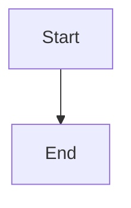

# 📊 Microservices Architecture Diagrams

This directory contains Mermaid diagrams that document the complete microservices architecture with Kafka Streams.

## 📁 Diagram Files

### 🏗️ **Main Diagram**
- **`architecture-diagram.mmd`** - Complete microservices infrastructure
  - All services, databases, and Kafka connections
  - Event topics and data flows
  - Differentiated styles by component type

### 🔄 **Sequence Diagrams**
- **`flow-sequences.mmd`** - User registration flow
- **`order-creation-flow.mmd`** - Order creation with CQRS
- **`analytics-flow.mmd`** - Real-time analytics processing

### 🏛️ **Architecture Patterns**
- **`cqrs-pattern.mmd`** - CQRS pattern in Order Service
- **`event-driven-flow.mmd`** - Event-driven communication
- **`kafka-streams.mmd`** - Kafka Streams architecture

### 🚀 **Technology Stack and Deployment**
- **`technology-stack.mmd`** - Complete technology stack
- **`deployment-architecture.mmd`** - Deployment architecture

### ⚙️ **Batch Processing**
- **`batch-processing-flow.mmd`** - Batch processing flow with Spring Batch

## 🎯 How to Use the Diagrams

### 1. **Online Visualization**
1. Go to [Mermaid Live Editor](https://mermaid.live/)
2. Copy the content of any `.mmd` file
3. The diagram will render automatically

### 2. **In GitHub/GitLab**
Diagrams render automatically in `.md` files with Mermaid blocks:

```markdown

```

### 3. **In Technical Documentation**
Include these diagrams in your technical documentation to explain:
- System architecture
- Data flows
- Design patterns
- Deployment processes

## 🔧 Diagram Features

### ✅ **Correct Syntax**
- Each diagram is in a separate file
- Valid Mermaid syntax
- No parsing errors

### 🎨 **Enhanced Visualization**
- Descriptive emojis for better identification
- Differentiated colors by component type
- Logically organized subgraphs
- Clear connections between components

### 📋 **Component Types**
- **Services** (blue) - Business microservices
- **Infrastructure** (purple) - Infrastructure services
- **Databases** (green) - Data storage
- **Kafka** (orange) - Event platform
- **Topics** (red) - Kafka topics

## 🚀 Main Documented Flows

### 1. **User Registration**
```
Client → Gateway → User Service → Kafka → Notification Service + Analytics Service
```

### 2. **Order Creation (CQRS)**
```
Client → Gateway → Order Service → User Service → Write DB → Kafka → Analytics Service
```

### 3. **Real-time Analytics**
```
Kafka Streams → Windowed Aggregations → Real-time Calculations → Analytics DB
```

### 4. **Event-Driven Communication**
```
Event Sources → Kafka Topics → Event Consumers → Analytics Output
```

### 5. **Batch Processing**
```
CSV Input → Spring Batch → Database → Alerts → Kafka Notifications
```

## 📈 Benefits of this Documentation

### 🔍 **Visual Clarity**
- Quick understanding of architecture
- Dependency identification
- Data flow visualization

### 🛠️ **Facilitates Development**
- Reference for new developers
- Guide for architectural decisions
- Documentation of implemented patterns

### 📊 **Analysis and Optimization**
- Bottleneck identification
- Scalability planning
- Data flow optimization

## 🔄 Diagram Updates

To keep diagrams updated:

1. **Modify code** as needed
2. **Update corresponding diagrams**
3. **Verify syntax** in Mermaid Live Editor
4. **Update related documentation**

## 📚 Additional Resources

- [Mermaid Documentation](https://mermaid.js.org/)
- [Mermaid Live Editor](https://mermaid.live/)
- [GitHub Mermaid Support](https://github.blog/2022-02-14-include-diagrams-markdown-files-mermaid/)

---

**Note**: All diagrams are optimized for rendering in GitHub, GitLab, and Mermaid-compatible editors. 