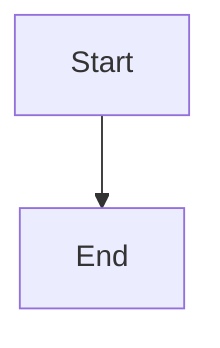

# 📊 Diagramas de Arquitectura de Microservicios

Este directorio contiene diagramas Mermaid que documentan la arquitectura completa de microservicios con Kafka Streams.

## 📁 Archivos de Diagramas

### 🏗️ **Diagrama Principal**
- **`architecture-diagram.mmd`** - Infraestructura completa de microservicios
  - Todos los servicios, bases de datos y conexiones Kafka
  - Topics de eventos y flujos de datos
  - Estilos diferenciados por tipo de componente

### 🔄 **Diagramas de Secuencia**
- **`flow-sequences.mmd`** - Flujo de registro de usuarios
- **`order-creation-flow.mmd`** - Creación de órdenes con CQRS
- **`analytics-flow.mmd`** - Procesamiento de analytics en tiempo real

### 🏛️ **Patrones de Arquitectura**
- **`cqrs-pattern.mmd`** - Patrón CQRS en Order Service
- **`event-driven-flow.mmd`** - Comunicación basada en eventos
- **`kafka-streams.mmd`** - Arquitectura de Kafka Streams

### 🚀 **Stack Tecnológico y Despliegue**
- **`technology-stack.mmd`** - Stack tecnológico completo
- **`deployment-architecture.mmd`** - Arquitectura de despliegue

## 🎯 Cómo Usar los Diagramas

### 1. **Visualización en Línea**
1. Ve a [Mermaid Live Editor](https://mermaid.live/)
2. Copia el contenido de cualquier archivo `.mmd`
3. El diagrama se renderizará automáticamente

### 2. **En GitHub/GitLab**
Los diagramas se renderizan automáticamente en archivos `.md` con bloques Mermaid:

```markdown

```

### 3. **En Documentación Técnica**
Incluye estos diagramas en tu documentación técnica para explicar:
- Arquitectura del sistema
- Flujos de datos
- Patrones de diseño
- Procesos de despliegue

## 🔧 Características de los Diagramas

### ✅ **Sintaxis Correcta**
- Cada diagrama está en un archivo separado
- Sintaxis Mermaid válida
- Sin errores de parsing

### 🎨 **Visualización Mejorada**
- Emojis descriptivos para mejor identificación
- Colores diferenciados por tipo de componente
- Subgrafos organizados lógicamente
- Conexiones claras entre componentes

### 📋 **Tipos de Componentes**
- **Servicios** (azul) - Microservicios de negocio
- **Infraestructura** (morado) - Servicios de infraestructura
- **Bases de Datos** (verde) - Almacenamiento de datos
- **Kafka** (naranja) - Plataforma de eventos
- **Topics** (rojo) - Topics de Kafka

## 🚀 Flujos Principales Documentados

### 1. **Registro de Usuarios**
```
Cliente → Gateway → User Service → Kafka → Notification Service + Analytics Service
```

### 2. **Creación de Órdenes (CQRS)**
```
Cliente → Gateway → Order Service → User Service → Write DB → Kafka → Analytics Service
```

### 3. **Analytics en Tiempo Real**
```
Kafka Streams → Windowed Aggregations → Real-time Calculations → Analytics DB
```

### 4. **Comunicación Event-Driven**
```
Event Sources → Kafka Topics → Event Consumers → Analytics Output
```

## 📈 Beneficios de esta Documentación

### 🔍 **Claridad Visual**
- Entendimiento rápido de la arquitectura
- Identificación de dependencias
- Visualización de flujos de datos

### 🛠️ **Facilita el Desarrollo**
- Referencia para nuevos desarrolladores
- Guía para decisiones de arquitectura
- Documentación de patrones implementados

### 📊 **Análisis y Optimización**
- Identificación de cuellos de botella
- Planificación de escalabilidad
- Optimización de flujos de datos

## 🔄 Actualización de Diagramas

Para mantener los diagramas actualizados:

1. **Modifica el código** según sea necesario
2. **Actualiza los diagramas** correspondientes
3. **Verifica la sintaxis** en Mermaid Live Editor
4. **Actualiza la documentación** relacionada

## 📚 Recursos Adicionales

- [Mermaid Documentation](https://mermaid.js.org/)
- [Mermaid Live Editor](https://mermaid.live/)
- [GitHub Mermaid Support](https://github.blog/2022-02-14-include-diagrams-markdown-files-mermaid/)

---

**Nota**: Todos los diagramas están optimizados para renderizado en GitHub, GitLab y editores compatibles con Mermaid. 